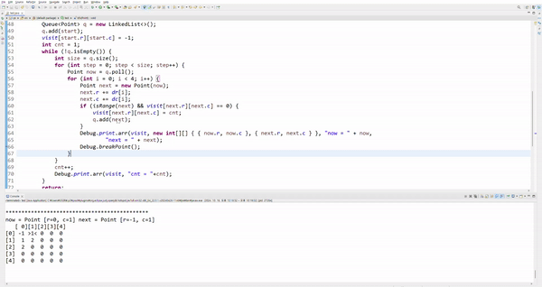
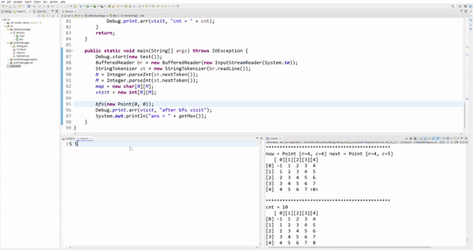
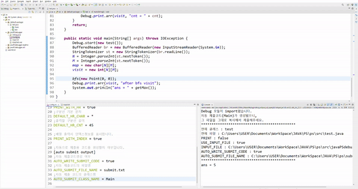

# Debug

- 문제 풀 때마다 2차원 배열, 1차원 배열을 찍고 제출할 때 다시 지웠다가 제출하고 틀렸으면 다시 찍고 어쩔 때는 input파일 입력으로 넣었다가 파일 찾을 수 없다고 뜰 때마다 번거로워서 간단한 디버깅용 클래스를 만들었습니다.
- 편하게 배열을 보기쉽게 출력할 수 있고, 설정파일과 입력파일만 수정해가면서 문제풀이에 활용해보세요
- 복잡한 설치과정 없이 자바 프로젝트 `src` 파일에 clone해서 바로 사용가능합니다.
- 상세한 설명은 [여기](./readme/README_detail.md)를 확인해주세요

## 사용

### 설치

- **프로젝트 src폴더에서** `git clone https://github.com/HEO-hyunjun/javaPSdebugger.git`명령어를 입력하세요

### 시작

- main메서드의 첫부분에 `Debug.start(new 현재클래스())`를 호출합니다.

### 배열 출력 함수

- `Debug.print.arr()`함수는 **`출력할 배열, [출력할 행의 수, 열의 수], [좌표], [출력전메세지]`** 순으로 입력을 넣을 수 있습니다.
  `[]`는 생략가능합니다.

### 좌표 강조하기

- 특정 좌표를 강조할수도 있습니다.
- 좌표는 `int[] {행, 열}` 혹은 `int[][] {{행1,열1}, {행2,열2} ...}`으로 넣어줍니다.

- 특정 좌표를 강조할때 좌표 클래스를 넣을수도 있습니다.
- 다만, `CoordinateDebugger`를 상속받고, `getRow(), getCol()`함수를 오버라이드해야합니다.
- 단순히 행, 열에 대한 정보를 반환하는 함수입니다.

### 설정파일

- `Config.ini`파일을 수정하여 원하는 방식으로 입출력을 제어할 수 있습니다.

- 문제를 풀고, 코드를 제출할때 클래스명을 수정하거나 디버그에 사용했던 각종 라인들을 수정할 필요 없이, 제출용코드가 생성됩니다.
- 자동 제출용코드 작성은 [여기](./readme/README_detail.md)를 확인해주세요

readme 폴더의 [example.java](./readme/example.java) 파일을 참고해주세요

## 주요 기능

- print : 출력과 관련된 기능
  - arr : 1차원, 2차원 int,boolean, char배열을 출력합니다. 출력할 크기, 강조할 위치, 같이 출력할 문구를 옵션으로 넣을 수 있습니다.
  - hr : 구분선을 출력합니다.
- config : 출력, input파일 사용 여부 등 다양한 옵션과 관련된 설정 변수들이 저장돼있습니다.
- timer : 코드 실행시간,메모리를 측정하는 기능이 들어있습니다.
- 제출용 코드를 자동으로 생성합니다.

## 주의사항

- **UTF-8로 IDE encoding을 바꿔주세요.**
- main()메소드 **가장 첫부분에서** `Debug.start(Object)`함수를 호출해줍니다.
  - 매개변수로는 `main()`함수가 구동되는 클래스의 인스턴스를 넣어줍니다.
  - ex 문제풀이 중인 클래스의 이름이 `test`라면, `Debug.start(new test());`를 main문 시작부분에 작성합니다.

## Config.ini 설정

[Config.ini](./Config.ini) 파일에는 다양한 설정 옵션들이 있습니다.주석을 확인해보시고, 자세한 내용은 [여기](./readme/README_detail.md)를 참고해 주세요.
