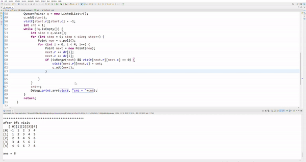
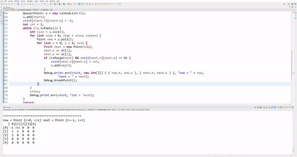
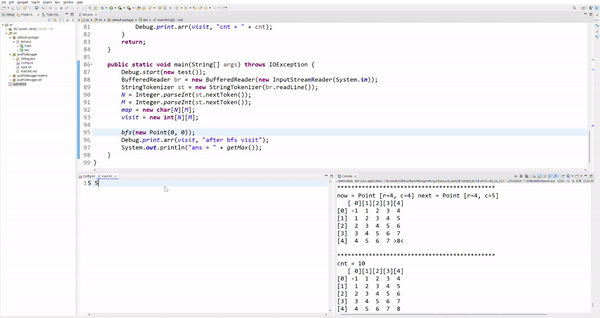
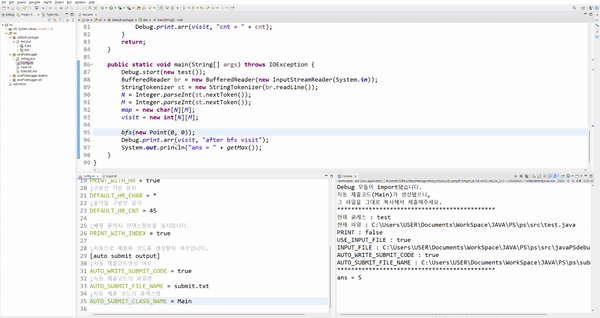

# Debug

- 문제 풀 때마다 2차원 배열, 1차원 배열을 찍고 제출할 때 다시 지웠다가 제출하고 틀렸으면 다시 찍고 어쩔 때는 input파일 입력으로 넣었다가 파일 찾을 수 없다고 뜰 때마다 번거로워서 간단한 디버깅용 클래스를 만들었습니다.
- 편하게 배열을 보기쉽게 출력할 수 있고, 설정파일과 입력파일만 수정해가면서 문제풀이에 활용해보세요
- 복잡한 설치과정 없이 자바 프로젝트 `src` 파일에 clone해서 바로 사용가능합니다.

## 사용

### 설치


- **프로젝트 src폴더에서** `git clone https://github.com/HEO-hyunjun/javaPSdebugger.git`명령어를 입력하세요

### 시작


- main메서드의 첫부분에 `Debug.start(new 현재클래스())`를 호출합니다.

### 배열 출력 함수


- `Debug.print.arr()`함수는 **`출력할 배열, [출력할 행의 수, 열의 수], [좌표], [출력전메세지]`** 순으로 입력을 넣을 수 있습니다.
  `[]`는 생략가능합니다.

### 좌표 강조하기



- 특정 좌표를 강조할수도 있습니다.
- 좌표는 `int[] {행, 열}` 혹은 `int[][] {{행1,열1}, {행2,열2} ...}`으로 넣어줍니다.



- 특정 좌표를 강조할때 좌표 클래스를 넣을수도 있습니다.
- 다만, `CoordinateDebugger`를 상속받고, `getRow(), getCol()`함수를 오버라이드해야합니다.
- 단순히 행, 열에 대한 정보를 반환하는 함수입니다.

### 설정파일



- `Config.ini`파일을 수정하여 원하는 방식으로 입출력을 제어할 수 있습니다.



- 문제를 풀고, 코드를 제출할때 클래스명을 수정하거나 디버그에 사용했던 각종 라인들을 수정할 필요 없이, 제출용코드가 생성됩니다.
- 자동 제출용코드 작성은 [여기](./readme/README_detail.md)를 확인해주세요

readme 폴더의 [example.java](./readme/example.java) 파일을 참고해주세요

## 주요 기능

- print : 출력과 관련된 기능
  - arr : 1차원, 2차원 int,boolean, char배열을 출력합니다. 출력할 크기, 강조할 위치, 같이 출력할 문구를 옵션으로 넣을 수 있습니다.
  - hr : 구분선을 출력합니다.
- config : 출력, input파일 사용 여부 등 다양한 옵션과 관련된 설정 변수들이 저장돼있습니다.
- timer : 코드 실행시간,메모리를 측정하는 기능이 들어있습니다.
- 제출용 코드를 자동으로 생성합니다.

## 주의사항

- **UTF-8로 IDE encoding을 바꿔주세요.**
- main()메소드 **가장 첫부분에서** `Debug.start(Object)`함수를 호출해줍니다.
  - 매개변수로는 `main()`함수가 구동되는 클래스의 인스턴스를 넣어줍니다.
  - ex 문제풀이 중인 클래스의 이름이 `test`라면, `Debug.start(new test());`를 main문 시작부분에 작성합니다.

## Config.ini 설정

[Config.ini](./Config.ini) 파일에는 다양한 설정 옵션들이 있습니다.

- `USE_INPUT_FILE`: 입력 파일 사용 여부

  - `true`: 입력 파일을 사용합니다.
  - `false`: 콘솔에서 직접 입력을 받습니다.

- `INPUT_FILE`: 사용할 입력 파일명

  - 예: `input.txt`

- `AUTO_WRITE_SUBMIT_CODE`: 제출용 코드 자동 생성 여부
  - `true`: Debug 관련 코드를 제거한 제출용 코드를 자동으로 생성합니다.
  - `false`: 제출용 코드를 자동생성하지 않습니다.
- `AUTO_WRITE_JAVA_FILE`: 자동 제출 코드를 java파일로 생성할지 여부

  - `true`: 제출용 코드를 자동으로 생성하되, 제출용코드의 파일명을 무시하고 `(AUTO_SUBMIT_CLASS_NAME).java`로 생성됩니다.
  - `false`: `AUTO_SUBMIT_FILE_NAME`으로 제출용코드가 생성됩니다.

- `AUTO_SUBMIT_FILE_NAME` : 제출용 코드의 파일명
  - 예: `submit.txt`
- `AUTO_SUBMIT_CLASS_NAME`: 제출용 코드의 클래스명

  - 예: `Main`, `Solution`

- `PRINT`: Debug.print 메서드들의 출력 여부 (Debug.timer는 이와 무관하게 출력됩니다)

  - `true`: Debug.print 함수의 출력을 활성화합니다.
  - `false`: Debug.print 함수의 출력을 비활성화합니다.

- `PRINT_WITH_HR`: 배열 출력 시 구분선 사용 여부

  - `true`: 배열 출력 시 구분선을 사용합니다.
  - `false`: 배열 출력 시 구분선을 사용하지 않습니다.

- `IGNORE_MIN_MAX_VAL`: int배열을 출력할때 Integer.MAX_VALUE, MIN_VALUE를 IGNORE_CHAR로 대신 출력할지 여부

  - `true`: Integer.MAX_VALUE, MIN_VALUE를 IGNORE_CHAR로 대신 출력합니다.
  - `false`: Integer.MAX_VALUE, MIN_VALUE를 그대로 출력합니다.

- `IGNORE_CHAR`: IGNORE_MIN_MAX_VAL이 true일때, Integer.MAX_VALUE, MIN_VALUE대신 출력할 문자
  - 예: `&`

이러한 설정들을 통해 디버깅 환경을 사용자의 필요에 맞게 커스터마이즈할 수 있습니다.

## Debug.print.arr() 사용법

- `print`객체에 포함된`arr`함수는 다양한 배열과 출력방식을 지원합니다.
- Config파일에 `PRINT_WITH_HR`값이 `true일때` 구분선으로 구분됩니다.
- `print.arr(array,[rowSize,colSize], [coordinate], [startText...])`
- 배열출력에 가장 중요한 순서부터 나열했습니다.
  1.  필수로 들어가야할 출력할 배열
  2.  이후로는 각각 생략가능합니다.
      1. 출력할 배열의 크기(행, 열)
      2. 출력을 대체할 좌표정보 (행, 열, 대체할 문자)
      3. 배열 출력 전에 같이 출력할 메세지를 입력합니다. 복수의 문자열이 들어갈 수 있으며, 공백으로 구분됩니다.

### array

- array 매개변수는 출력할 대상이 될 매개변수입니다.
- 출력할 배열은 항상 가장 맨 앞에 **필수**로 들어가야 합니다.
- arr함수는 `int[][], int[], boolean[][], boolean[], char[][], char[]`을 지원합니다.

### size

- 출력할 배열의 크기를 지정할 수 있는 매개변수입니다.
- size는 **`row, col`순으로 같이** 입력 돼야 합니다.
- 생략할 수 있는 변수이며 생략 시에는 `array`의 전체를 출력합니다.
- 아래의 코드와 같다고 생각하면 됩니다.
- 2차원 배열의 경우,

```java
for(int i=0; i<row; i++)
	for(int j=0; j<col; j++)
		print(arr[i][j]);
```

- 1차원 배열의 경우,

```java
for(int i=start, i<end; i++)
	print(arr[i])
```

### coordinate

- 특정 행, 열 위치의 값을 강조하는 옵션입니다.
- 좌표를 입력할 수 있는 방법은 총 4가지입니다.
  - (단일) 직접 좌표 : `int row, int col`형태로 단 하나의 좌표를 강조합니다.
  - (단일) 클래스 좌표 : `CoordinateDebugger cor` 형태로 단 하나의 좌표를 강조합니다.
  - (복수) 배열 좌표 : `int[][] cors` 형태로 `[idx][row = 0, col = 1]`저장된 배열의 위치들을 전부 강조합니다.
  - (복수) 클래스 배열 좌표 : `CoordinateDebugger[] cors` 형태로 좌표 클래스 내부의 좌표들을 전부 강조합니다.

#### coordinate 사용 예시

- 원본 배열

```
SIZE = 4
arr =
{
0 0 0 0
0 0 1 0
0 0 0 1
1 1 0 0
}
```

##### 직접 좌표

- (단일) 직접좌표 :

```java
// (단일) 가장 왼쪽 위에 존재하는 1을 강조
int row = -1, col = -1;
for(int i=0; i<SIZE && row == -1; i++){
	for(int j=0; j<SIZE && col == -1; j++){
		if(arr[i][j] == 1){
			row = i; col = j;
		}
	}
}
Debug.print.arr(arr,new int[]{row,col});
```

```
출력
   [0][1][2][3]
[0] 0  0  0  0
[1] 0  0 >1< 0
[2] 0  0  0  1
[3] 1  1  0  0
```

- (복수) 배열좌표 :

```java
// (복수) (0,0) 좌표와, 1을 모두 강조
int[][] cors = new int[5][2];
int cnt = 1;
for(int i=0; i<SIZE; i++){
	for(int j=0; j<SIZE; j++){
		if(arr[i][j] == 1){
			cors[cnt][0] = i;
			cors[cnt][1] = j;
			cnt++;
		}
	}
}
Debug.print.arr(arr,cors);
```

```
출력
   [0][1][2][3]
[0]>0< 0  0  0
[1] 0  0 >1< 0
[2] 0  0  0 >1<
[3]>1<>1< 0  0
```

##### 클래스 좌표

```java
// 예시 클래스
class CustomClass implements CoordinateDebugger{ // CoordinateDebuger를 상속받아야합니다.
	int y, x;
	public CustomClass(int y, int x){
		this.y = y;
		this.x = x;
	}
	// Debuger에게 넘겨줄 행과 열을 제공할 함수를 오버라이드합니다.
	@Override
	public int getRow() {
		return y;
	}

	@Override
	public int getCol() {
		return x;
	}
}
```

- (단일) 클래스 좌표 :

```java
// (단일) 가장 왼쪽 위에 존재하는 1을 강조
int row = -1, col = -1;
for(int i=0; i<SIZE && row == -1; i++){
	for(int j=0; j<SIZE && col == -1; j++){
		if(arr[i][j] == 1){
			row = i; col = j;
		}
	}
}
Debug.print.arr(arr, new CustomClass(row, col));

CustomClass cor = new CustomClass(row, col);
Debug.print.arr(arr, cor);
```

```
출력
   [0][1][2][3]
[0] 0  0  0  0
[1] 0  0 >1< 0
[2] 0  0  0  1
[3] 1  1  0  0
```

- (복수) 클래스 배열 좌표 :

```java
// (복수) (0,0) 좌표와, 1을 모두 강조
CustomClass[] cors = new CustomClass[5];
cors[0] = new CustomClass(0,0);

int cnt = 1;
for(int i=0; i<SIZE; i++){
	for(int j=0; j<SIZE; j++){
		if(arr[i][j] == 1){
			cors[cnt++] = new CustomClass(i,j);
		}
	}
}
Debug.print.arr(arr,cors);
```

```
출력
   [0][1][2][3]
[0]>0< 0  0  0
[1] 0  0 >1< 0
[2] 0  0  0 >1<
[3]>1<>1< 0  0
```

### startText

- 배열을 출력하기 전에 출력할 문구입니다.
- 이 매개변수는 0개 이상 입력으로 사용될 수 있습니다.
- 2개 이상 입력될 경우, 한줄씩 출력됩니다.
